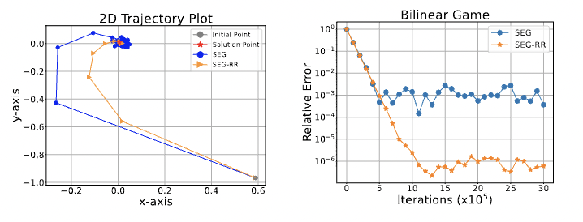

	

The folder contains the following scripts:
- sc_sc_experiments.py for reproducing the strongly convex - strongly concave experiments
- bilinear_games.py for reproducing the affine (bilinear) problems 
- WGAN_experiments for the experiments on GANs

You will need to have installed the Optimizer Module in order to reproduce the experiments of the paper (see [Getting Started section](https://github.com/emmanouilidisk/Stochastic-ExtraGradient-with-Random-Reshuffling/tree/main)).

You can access/download the saved checkpoints of the experiments in the paper at this [link](https://drive.google.com/file/d/1r5Ikd6f6y560Hn196NdCT6tYcgNcKXYA/view?usp=sharing). 
